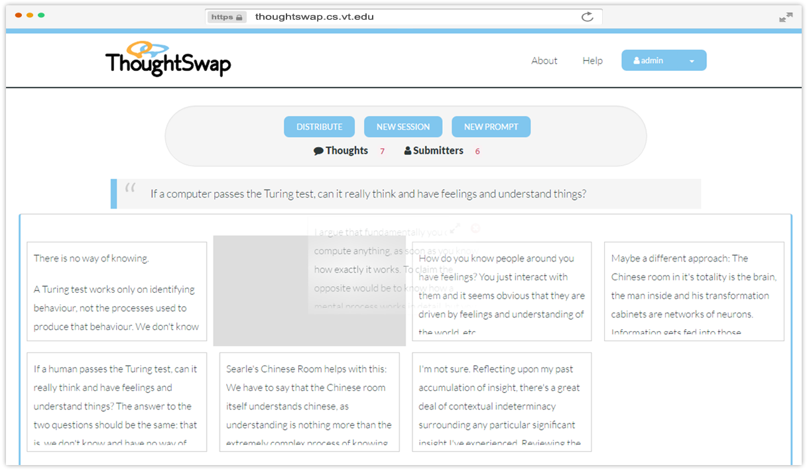

# 

A web app that aims to widen and deepen the scope of participation in 
facilitated discussions by minimizing participant self-consciousness,
social intimidation, and time pressure.

## Project in Action
ThoughtSwap is actively being tested and used at [Virginia Tech](https://vt.edu)
in classroom discussions by over 200 students. You can view the project's home 
at [thoughtswap.cs.vt.edu](http://thoughtswap.cs.vt.edu/)

For discussion facilitators, ThoughtSwap provides a platform for the creation of
groups, group sessions with prompts, and a platform to moderate and discuss 
responses. For participants it provides a platform for viewing the prompt, and
sharing their thoughts. A system of "silly name" generation for usernames and
random thought distribution helps to anonymize them from their peers.

A glimpse of this can be seen below:

### Participant View

### Facilitator View


## Contributing

For general contribution guidelines see [CONTRIBUTING](CONTRIBUTING.md). To
get started:

### Step 1: Fork
Fork the [core repository](https://github.com/VT-CHCI/Thought-Swap) and check
out your copy locally.
```
$ git clone git@github.com:VT-CHCI/Thought-Swap.git
$ cd Thought-Swap
$ git remote add upstream git://github.com/VT-CHCI/Thought-Swap.git
```

### Step 2: Install Node and MySQL Server
Ensure that you have the necessary tools for development. If you are a Mac user then use [Homebrew](https://brew.sh/) to install Node and MySQL Server.
* [Node](https://nodejs.org/en/)
* [MySQL Server](https://dev.mysql.com/downloads/mysql/) 
* (Optional) [MySQLWorkbench](https://dev.mysql.com/downloads/workbench/)

### Step 3: Install Dependencies
Ensure that you are in the same directory as package.json. Set up the application by installing the dependencies.
<!---and then running the test suite to check that everything is in working order as such:$ npm test--> 
```
$ npm install
```

### Step 4: Create a Database
Create a database for ThoughtSwap in your local MySQL Server or with MySQL Workbench.

### Step 5: Create a Non-Root Database User
Create a non-root database user in your local MySQL Server or in MySQL Workbench that can access the ThoughtSwap database schema that you just created.

### Step 6: Create Environment Variables
Create three environment variables with names that are expected in app.models.js. The three names should be TS_DB, TS_USER, and TS_PASS. Their values are the names for the database schema and non-root user that you created in your local MySQL Server or MySQL Workbench. 

### Step 7: Launch the Server
Ensure that you are in the same directory as package.json. Start up the app with ```$ npm start``` and navigate to localhost on the given port in your browser of choice.

### (Optional) Step 8: Registering Users
Click on “Facilitator Login” to register yourself as a facilitator. Create a username and password in the facilitator login page and click “Register”. Enter in an email and click “Register”. 

### (Optional) Step 9: Create Groups
You can create groups in the Discussion Groups page. Go ahead and click “New Group”. You will enter a “Group Name” that can be, for example, CS101. Enter a participant number. Click “Create”. Your group should show up under Discussion Groups. Click on the plus sign to the right of your new group and the names of your participants will appear.

<br>

## Recognitions

Thought-Swap © 2014+, Center for Human-Computer Interaction at Virginia Tech 
(VTCHCI). Released under the [MIT License](LICENSE). Special thanks to our
[contributors](https://github.com/VT-CHCI/Thought-Swap/graphs/contributors).
